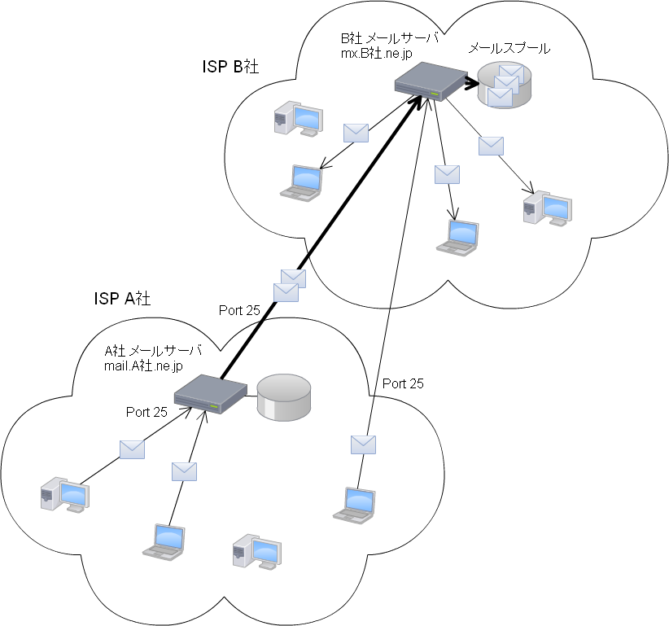
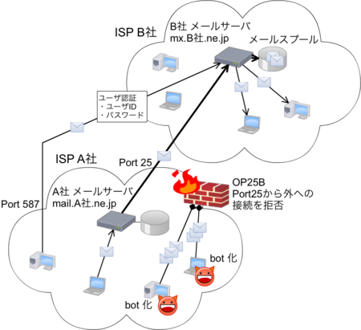
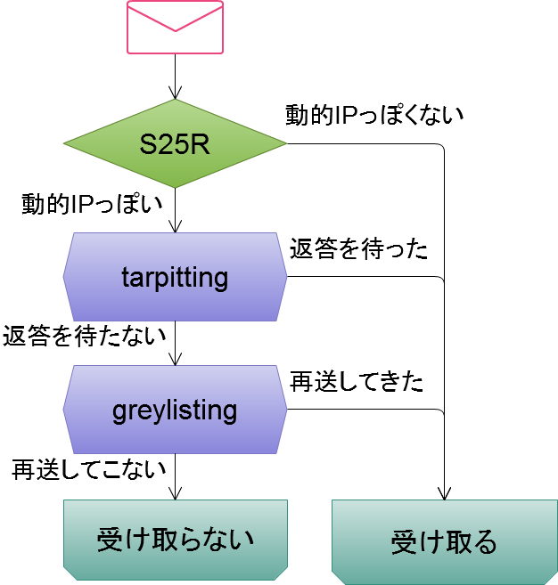
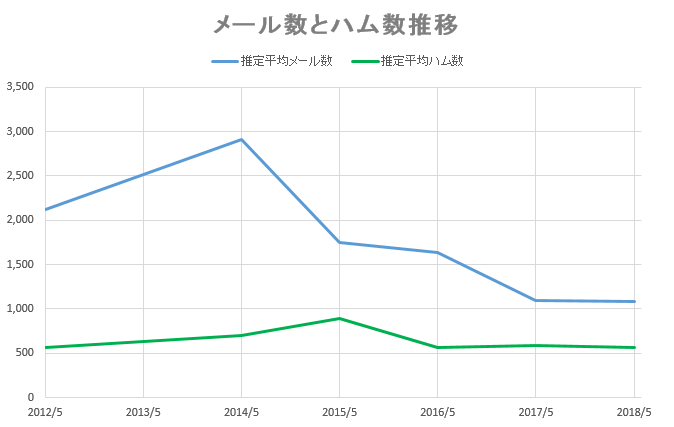
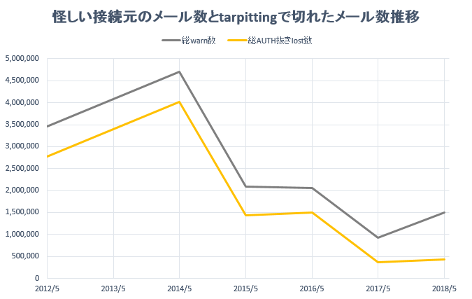
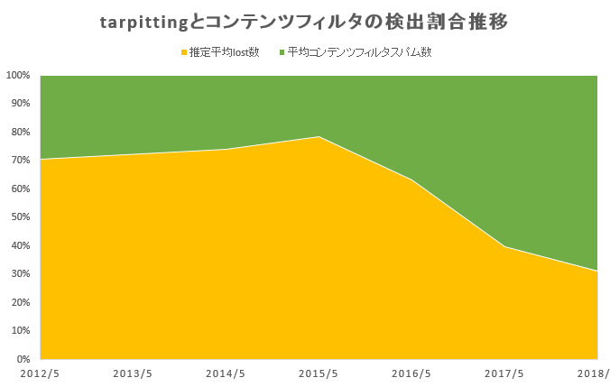

# スパム対策お焚き上げ

- NSEG #101
- 2018/6/30
- さとうきよし
- @stealthinu

# 自己紹介

- 有限会社ジーワークス
- 長野県白馬村
- スキーしたかったから移住
- 17年くらい地方中規模ISP様の常駐仕事

# どんな話？

- 題名は以前の@t_wada氏の発表 [SQLアンチパターンのお焚き上げ](https://nseg.connpass.com/event/73807/)パクり
- 以前自分が考案したスパム手法taRgreyのおさらい
- taRgreyの現在の状況ログからスパムの現状を読み解く

# スパム対策についておさらい

- 2010年にNSEG #10で発表した資料を元におさらい

# 2010年当時のスパム現状

- スパム率70%～80%程度という感じで年々増えていた
- 97%前後がbotnetから出されたスパムだった
- 日本発のスパムはOP25Bにより激減していた

# スパムはbotnetが主流だった

- スパムのうち97%前後がbotnetから出されていた
- ウイルス感染して遠隔操作可能にしたPCから出す
- 大半は海外の動的IPから送信
- 大量のメールを出すため再送やタイムアウト待ちしない

# 普通のメール送信

# botnetからのスパム送信

# 日本語スパムはbotnet利用せず

- 中国、フィリピン、タイ等の半固定的IPから送信
- レンタルサーバや事務所に多数サーバを置く
- qmailやpostfixをそのまま利用
- またはWindows PCでスパム送信専用ツール利用

# 実際にやってた人の記事

- [迷惑メールを追う（上）【西日本新聞】](https://www.nishinippon.co.jp/nnp/anatoku/article/394612/)
- 2018/2の記事でそこから10年ほど前の話
- 「出会い系サイト」誘導スパム
- 中国、欧州、南米、アフリカなどにメールサーバー千台以上分散して配置
- １日あたり２億通送信
- １億人に送った場合、返信があるのは千人ほど
- 返信に対してバイトが対応してポイントを購入させる

# スパム対策手法を大きく3種に分類

- メール本文を解析するコンテンツフィルタ
- 送信者の「クセ」を利用したSMTPセッションフィルタ
- ネットワークでスパム送信自体を制限

# メール本文を解析する コンテンツフィルタ

- 主に本文の内容を解析して判定
- 主な例：ベイジアンフィルタ
- キーワードとその「スパムらしさ」を機械学習する  
  「バイアグラ」が含まれてるなら99%スパム  
  「出会い」「お金」が含まれてるなら95%スパム  
  などを積算して判定

# SMTPセッションフィルタ

- SMTPセッション時の相手の「クセ」で判定
- S25R  
  「動的IPっぽい」逆引き名を拒否  
  例:evrtwa1-ar3-4-65-157-048.evrtwa1.dsl-verizon.net
- greylisting
  一時拒否して再送してきたら受け取る  
  スパムは到達性は求めないからわざわざ再送しない
- tarpitting  
  SMTPセッションの返答を何10秒か待たせる  
  スパムは大量に送りたいので遅い相手は切る

# greylistingによるスパムフィルタ

# tarpittingによるスパムフィルタ

# ネットワークで送信制限

- スパムを受け取らないのではなく出させない対策
- OP25B (Outbound Port 25 Blocking)
- ISPが自ネットワークから外向けSMTP接続を止める
- 日本では2005～2007年くらいに掛けて一気に普及
- これで日本発のスパムが劇的に減った

# botnetからのスパム送信

# OP25Bでの送信制限

# taRgrey

- taRgreyはSMTPセッション情報でのフィルタを 複数組み合わせたフィルタ
- S25Rで動的IPっぽいものだけ
- 返答の遅延を掛ける(120秒とか)
- その間に勝手にあきらめるのを待つ
- 同一IPから再送されてきたら遅延掛けずに通す
- 85%弱のスパムを排除していた

# taRgreyフローチャート

# taRgreyの目的

- taRgreyは誤検出や遅延がなるべく少なく
- 大部分のスパムを削減することが目的
- taRgreyだけでスパムを削除することは求めない

# 2010年当時の状況

|                    |  率 |
|--------------------|-----|
| スパム率            | 69% |
| S25Rのスパムマッチ率 | 93% |
| tarpitingでの駆除率 | 91% |
| taRgreyでの駆除率   | 85% |

# ここから今の話

- ここ6年くらいのメールやスパムの状況

# メール総数とスパム数

| アカウントあたり | 2014年まで    | 2018年現在    |
|-----------------|---------------|--------------|
| メール数         | 2,500通/月ほど | 1,000通/月弱 |
| スパム数         | 2,000通/月ほど | 500通/月ほど |

# スパム率

- 2014年くらいまでずっと75%くらいだった
- その後徐々に低下し2018年には50%を切る

# メール総数とハム数

- 正常なメール（ハム）は意外に減っていない

# スパムは確実に減っている

- スパムはここ3,4年で大きく減っている
- 意外に普通のメール流量は減っていない
- どんなスパムが減ったのか？

# 怪しい接続元メール数大幅減

- S25Rに掛かる接続元は70%減程度に激減
- tarpittingで切断されたメール数も合わせて減少

# tarpittingでの切断率大幅低下

- 2014年くらいまでずっと80%程度だった
- その後2018年には30%にまで急激に低下

# フィルタ種での比較

- コンテンツフィルタは30%減程
- tarpittingは85％も激減

# tarpittingの1次フィルタの効果

- 2015年頃まではずっと70%～80%維持
- 以降急激に低下しついに30%程度に

# botnetからの送信が減った

- S25Rで引っ掛かるスパムが激減
- tarpittingの効果があるスパムも激減
- tarpittingを抜ける「通常のメールサーバ」からは微減
- つまりbotnetからのスパム送信が大幅に減った

# submissionスパム

- botnetから送信認証させてスパム送信
- スパム側のOP25B対策
- ウイルス感染等で取得したアカウントを利用
- 2012年頃から

# OP25Bでの送信制限

# submissionスパム

# submissionポートへの攻撃

- submissionポートへの認証アクセス急増
- アカウントクラックを狙ったもの

# submissionスパム 実は「こっそり」送ってる

- クラックされたアカウントのログを解析
- せっかく盗ったアカウントを見つからないよう ちょっとづつこっそり送る
- 無茶な送り方をする「顧客」がいたときだけ見つかる

# 貴重なbotnetの資源を スパムに割かなくなった

- メールより効果の高いSNSなどを狙う
- 低効率のスパムではなく フィッシングなどより高効率なものに使う

# taRgrey は オ ワ コ ン

# 滅 せ ぬ も の の あ る べ き か

# SMTPセッションフィルタの終焉

- greylistingなども同じ
- botnetから送られなければ不要
- というかスパムがなければスパムフィルタは不要
- だから喜ぶべき話

# スパム対策側は勝ったのか

- スパム対策が進みスパムの効果が少なくなった
- OP25B普及でスパムを出すことが難しくなった
- メール自体の価値が相対的に低下してしまった  
  (暗号化、詐称、添付ファイル、既読確認、など)
- メールの価値低下はスパムの影響も大きい
- スパマーは他の「狩場」へ

# まとめ

- taRgreyはもう導入する意味がない
- メールはまだ生きてるが死につつある
- しかしスパマーも去った
